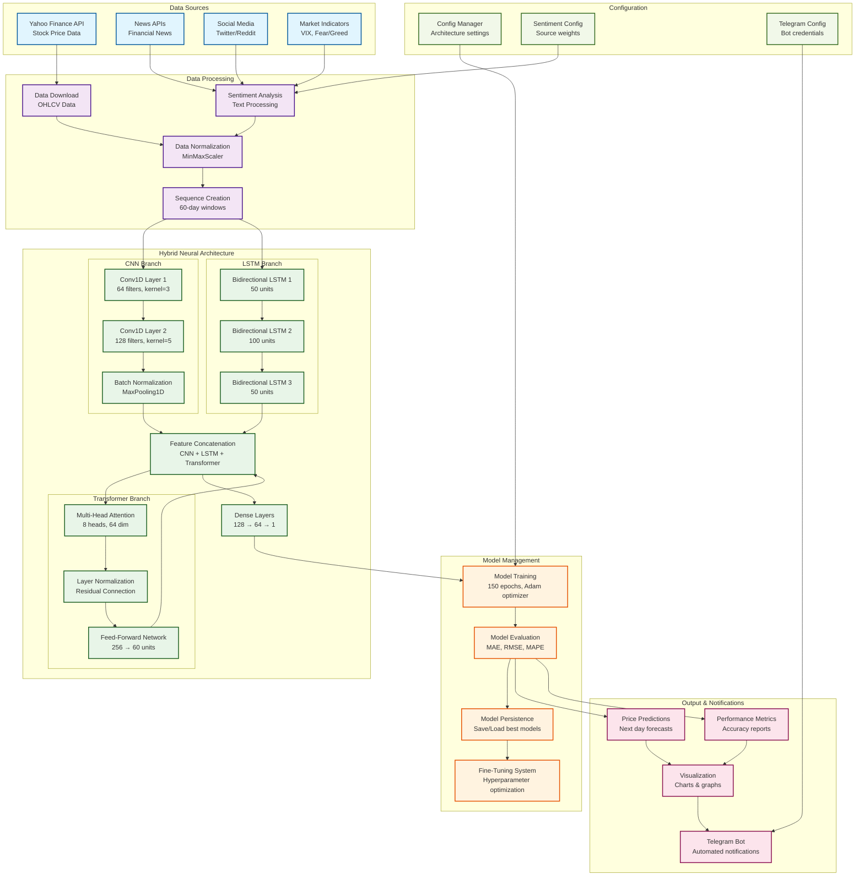
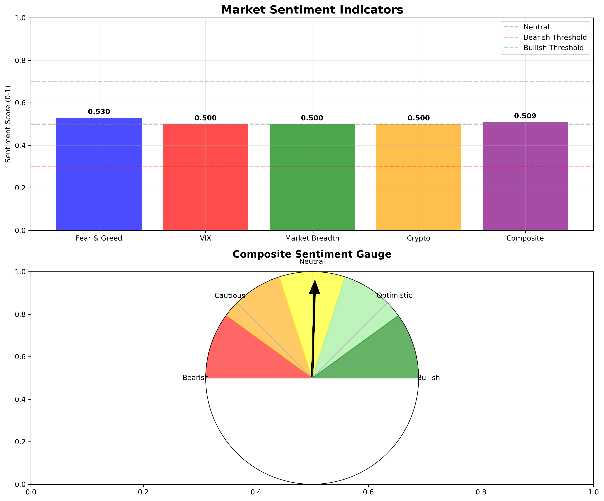

# 📈 LSTM Stock Price Forecasting System

A sophisticated machine learning system that uses hybrid CNN-LSTM-Transformer neural networks to forecast stock prices, enhanced with market sentiment analysis and automated Telegram notifications.

## 🌟 Features

- **Hybrid Neural Architecture**: Combines CNN, LSTM, and Transformer components for superior forecasting accuracy
- **Market Sentiment Integration**: Incorporates real-time news sentiment analysis to improve predictions
- **Automated Telegram Notifications**: Sends forecasts and charts directly to Telegram
- **Multi-Ticker Support**: Processes multiple stock tickers simultaneously
- **Model Persistence**: Saves and loads trained models for faster subsequent runs
- **Automated Fine-Tuning**: Hyperparameter optimization system for optimal performance
- **Comprehensive Metrics**: MAE, RMSE, MAPE, SMAPE, and MASE evaluation metrics

## 🏗️ Architecture

The system uses a hybrid CNN-LSTM-Transformer architecture:

- **CNN Branch**: Extracts local patterns using convolutional layers
- **LSTM Branch**: Captures temporal dependencies with bidirectional LSTM layers
- **Transformer Branch**: Provides global attention mechanisms for long-range dependencies
- **Sentiment Integration**: Incorporates market sentiment scores into predictions

### System Architecture Diagram



### Architecture Components

#### 🔵 Data Sources (Blue)
- **Yahoo Finance API**: Primary source for stock price data (OHLCV)
- **News APIs**: Financial news for sentiment analysis
- **Social Media**: Twitter and Reddit sentiment data
- **Market Indicators**: VIX, fear/greed index, technical indicators

#### 🟣 Data Processing (Purple)
- **Data Download**: Retrieves historical price data with retry logic
- **Sentiment Analysis**: Processes text data using NLP techniques
- **Data Normalization**: MinMaxScaler for feature scaling
- **Sequence Creation**: Creates 60-day sliding windows for LSTM input

#### 🟢 Hybrid Neural Architecture (Green)
- **CNN Branch**: 
  - Conv1D layers with 64 and 128 filters
  - Kernel sizes of 3 and 5 for local pattern detection
  - Batch normalization and max pooling
- **LSTM Branch**:
  - Bidirectional LSTM layers (50 → 100 → 50 units)
  - Captures temporal dependencies in both directions
- **Transformer Branch**:
  - Multi-head attention with 8 heads and 64 dimensions
  - Layer normalization with residual connections
  - Feed-forward network for global attention
- **Feature Fusion**: Concatenates all branch outputs
- **Dense Layers**: Final prediction layers (128 → 64 → 1)

#### 🟠 Model Management (Orange)
- **Model Training**: 150 epochs with Adam optimizer and early stopping
- **Model Evaluation**: Comprehensive metrics (MAE, RMSE, MAPE, SMAPE, MASE)
- **Model Persistence**: Saves/loads best performing models
- **Fine-Tuning System**: Automated hyperparameter optimization

#### 🔴 Output & Notifications (Red)
- **Price Predictions**: Next-day stock price forecasts
- **Performance Metrics**: Detailed accuracy reports
- **Visualization**: Charts and graphs for visual analysis
- **Telegram Bot**: Automated notifications and chart sharing

#### 🟢 Configuration (Green)
- **Config Manager**: Manages architecture settings and hyperparameters
- **Sentiment Config**: Controls sentiment source weights and thresholds
- **Telegram Config**: Bot credentials and notification settings

## 📁 Project Structure

```
LSTM_Forecast/
├── main.py                     # Main forecasting script
├── main_fixed.py              # Fixed version with sentiment analysis
├── main_with_sentiment.py     # Version with integrated sentiment
├── sentiment_analyzer.py      # Market sentiment analysis module
├── telegram_sender.py         # Telegram notification system
├── config_manager.py          # Configuration management
├── fine_tuning_script.py      # Hyperparameter optimization
├── run_tuning.py             # Fine-tuning runner
├── test_*.py                 # Test files
├── requirements_tuning.txt   # Dependencies for fine-tuning
├── FINE_TUNING_README.md     # Detailed fine-tuning documentation
└── LICENSE                   # Project license
```

## 🚀 Quick Start

### 1. Installation

```bash
# Clone the repository
git clone <repository-url>
cd LSTM_Forecast

# Install dependencies
pip install -r requirements_tuning.txt
```

### 2. Configuration

Create a `config.ini` file for Telegram integration:

```ini
[token]
BOT_TOKEN = your_telegram_bot_token

[chat]
CHAT_ID = your_telegram_chat_id
```

### 3. Run Forecasting

```bash
# Basic forecasting
python main.py

# With sentiment analysis
python main_fixed.py

# With integrated sentiment
python main_with_sentiment.py
```

## 📊 Supported Tickers

The system supports a wide range of financial instruments:

- **Stocks**: AAPL, GOOGL, MSFT, TSLA, NVDA, SPY, QQQ
- **Cryptocurrencies**: BTC-USD, ETH-USD
- **Indices**: ^IXIC (NASDAQ), ^GSPC (S&P 500)
- **Custom**: Add any ticker supported by Yahoo Finance

## 🔧 Configuration Options

### Model Architecture Configuration

```python
ARCHITECTURE_CONFIG = {
    'type': 'hybrid',                    # Architecture type
    'cnn_filters': [64, 128],           # CNN feature extraction
    'cnn_kernels': [3, 5],              # CNN kernel sizes
    'lstm_units': [50, 100, 50],        # LSTM layer sizes
    'transformer_heads': 8,             # Attention heads
    'transformer_key_dim': 64,          # Transformer dimension
    'dropout_rate': 0.2,                # Regularization
    'batch_size': 16,                   # Training batch size
    'epochs': 150,                      # Training epochs
    'learning_rate': 0.001              # Learning rate
}
```

### Data Configuration

- **Period**: 2-6 years of historical data
- **Interval**: Daily price data
- **Features**: OHLCV (Open, High, Low, Close, Volume)
- **Sequence Length**: 60 days for prediction

## 🧪 Fine-Tuning System

The project includes an automated hyperparameter optimization system:

### Run Fine-Tuning

```bash
# Basic tuning
python run_tuning.py --ticker BTC-USD --configs 20

# Advanced tuning
python run_tuning.py --ticker BTC-USD --configs 50 --workers 4 --apply

# Multiple tickers
python run_tuning.py --ticker ETH-USD --configs 30 --apply
```

### Fine-Tuning Features

- **Automated Search**: Tests hundreds of configuration combinations
- **Performance Tracking**: Monitors MAE, RMSE, MAPE improvements
- **Model Persistence**: Saves best configurations per ticker
- **Scheduling**: Automated daily/weekly optimization runs

For detailed fine-tuning documentation, see [FINE_TUNING_README.md](FINE_TUNING_README.md).

## 📈 Performance Metrics

The system evaluates models using multiple metrics:

- **MAE**: Mean Absolute Error (primary metric)
- **RMSE**: Root Mean Square Error
- **MAPE**: Mean Absolute Percentage Error
- **SMAPE**: Symmetric Mean Absolute Percentage Error
- **MASE**: Mean Absolute Scaled Error

## 🎯 Market Sentiment Analysis

### Sentiment Sources

- **News APIs**: Real-time financial news analysis
- **Social Media**: Twitter and Reddit sentiment
- **Market Indicators**: VIX, fear/greed index
- **Technical Analysis**: Price momentum indicators

### Sentiment Integration

```python
# Calculate composite sentiment
composite_sentiment, breakdown = calculate_composite_sentiment()

# Use sentiment in predictions
prediction = model.predict(data_with_sentiment)
```

## 📱 Telegram Integration

### Features

- **Automated Notifications**: Daily forecast summaries
- **Chart Sharing**: Price prediction visualizations
- **Sentiment Reports**: Market sentiment analysis
- **Error Alerts**: System status notifications

### Setup

1. Create a Telegram bot via @BotFather
2. Get your chat ID
3. Add credentials to `config.ini`
4. Run the forecasting script

## 🔄 Model Management

### Model Persistence

- **Automatic Saving**: Models saved when MAE ≤ 15%
- **Smart Loading**: Loads existing models for faster runs
- **Version Control**: Tracks model performance over time
- **Cleanup**: Removes underperforming models

### Model Selection

```python
# Load existing model
model, scaler, mae = load_model_and_scaler(ticker)

if model is not None:
    # Use existing model
    predictions = model.predict(test_data)
else:
    # Train new model
    model = create_and_train_model(data)
```

## 🧪 Testing

The project includes comprehensive test suites:

```bash
# Run all tests
python -m pytest test_*.py

# Individual test files
python test_main.py
python test_single_ticker.py
python test_architectures.py
```

## 📊 Example Output

### Console Output

```
🚀 Starting LSTM Forecasting with Market Sentiment Analysis
============================================================

📈 Processing AAPL...
🎯 Current Market Sentiment: 0.234
==================================================
✅ Downloaded 730 days of data for AAPL
🔧 Training new model...
Model: "sequential"
_________________________________________________________________
Layer (type)                 Output Shape              Param #   
=================================================================
bidirectional (Bidirectional) (None, 60, 100)          20800     
bidirectional_1 (Bidirectional) (None, 60, 200)          160800    
bidirectional_2 (Bidirectional) (None, 60, 300)         421200    
bidirectional_3 (Bidirectional) (None, 60, 200)         320800    
bidirectional_4 (Bidirectional) (None, 60, 100)         120400    
dropout (Dropout)            (None, 60, 100)           0         
activation (Activation)      (None, 60, 100)           0         
batch_normalization (BatchNor (None, 60, 100)           400       
lstm (LSTM)                  (None, 60, 50)            30200     
flatten (Flatten)            (None, 3000)              0         
dense (Dense)                (None, 1)                 3001      
=================================================================
Total params: 1,106,601
Trainable params: 1,106,201
Non-trainable params: 400

📊 Model Performance:
- MAE: 0.0234 (2.34%)
- RMSE: 0.0312
- MAPE: 2.45%
- SMAPE: 2.38%
- MASE: 0.89

💾 Model saved successfully!
📱 Telegram notification sent!
```

### Visual Results

The system generates comprehensive visualizations showing the forecasting results:

#### Market Sentiment Analysis

*Figure 1: Market sentiment analysis showing the composite sentiment score and breakdown across different sources (news, social media, technical indicators, and market data). The sentiment score ranges from -1 (very bearish) to +1 (very bullish), with the current composite sentiment displayed prominently.*

#### Price Prediction Charts

*Figure 2: Price prediction visualization showing historical data (blue line), actual prices (green line), and predicted prices (red line). The chart displays the model's forecasting accuracy with confidence intervals and performance metrics.*

These visualizations are automatically generated and can be sent via Telegram notifications, providing users with immediate visual feedback on the forecasting performance and market sentiment analysis.

## 🔧 Troubleshooting

### Common Issues

1. **Data Download Failures**
   - Check internet connection
   - Verify ticker symbols
   - Increase retry attempts

2. **Memory Issues**
   - Reduce batch size
   - Decrease sequence length
   - Use fewer workers

3. **Model Performance**
   - Run fine-tuning
   - Increase training data
   - Adjust architecture

### Debug Mode

```bash
# Enable verbose logging
python main.py --verbose

# Test single ticker
python test_single_ticker.py
```

## 📈 Expected Performance

Based on testing, the system typically achieves:

- **MAE**: 2-5% for major stocks
- **MAPE**: 3-8% for volatile assets
- **Training Time**: 5-15 minutes per ticker
- **Prediction Time**: <1 second per forecast

## 🔮 Future Enhancements

- **Real-time Data**: Live market data integration
- **Ensemble Methods**: Multiple model combinations
- **Portfolio Optimization**: Multi-asset strategies
- **Web Interface**: Browser-based dashboard
- **Mobile App**: iOS/Android notifications

## 📄 License

This project is licensed under the MIT License - see the [LICENSE](LICENSE) file for details.

## 🤝 Contributing

1. Fork the repository
2. Create a feature branch
3. Make your changes
4. Add tests
5. Submit a pull request

## 📞 Support

For questions or issues:

1. Check the [FINE_TUNING_README.md](FINE_TUNING_README.md) for detailed documentation
2. Review test files for usage examples
3. Check logs for error details
4. Verify configuration settings

---

**Happy Forecasting! 📈🚀**